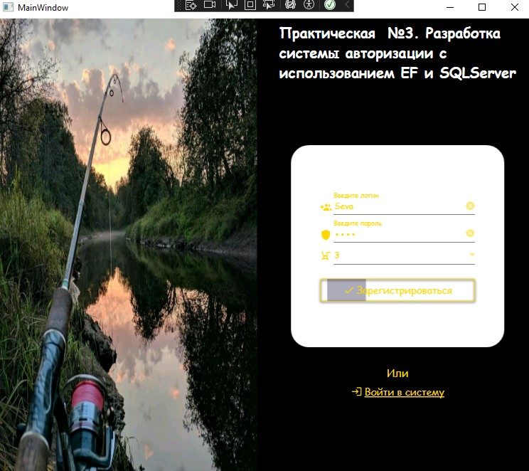
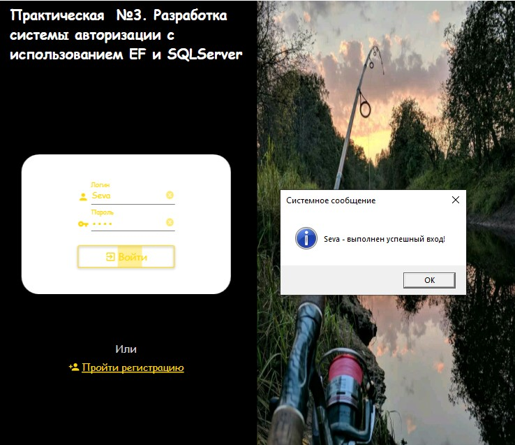

<h1>Задание 3. Разработка системы авторизации с использованием EF и SQLServer</h1>

  WPF-приложение для управления пользователями с возможностями:
  <ul>
    <li>Регистрация новых пользователей</li>
    <li>Аутентификация в системе</li>
  </ul>
  Реализовано с использованием Entity Framework Core и SQL Server.

  <strong>Требования для запуска:</strong>
  <ol>
    <li>Установленный SQL Server</li>
    <li>Настроенная база данных</li>
  </ol>

  
  

